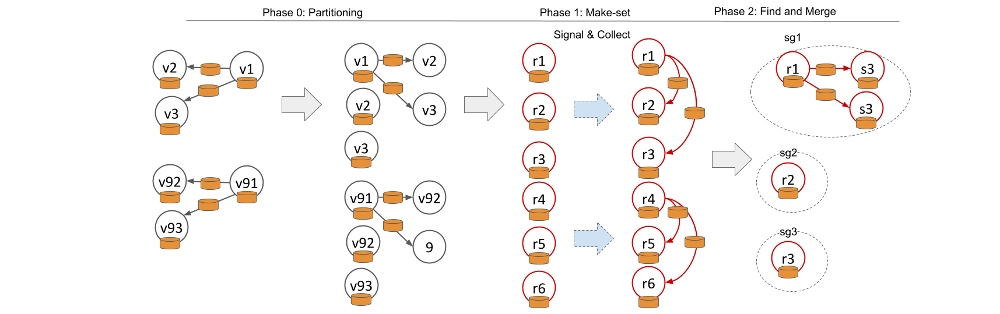

[](https://coveralls.io/github/t-blume/fluid-spark?branch=master)

# FLUID Spark

## Incremental and Parallel Computation of Structural Graph Summaries for Evolving Graphs

## General Idea
1. Load the data graph from disk (gzipped, n-triple files)
2. Parse the RDF graph into a spark labeled property graph
3. Phase 0: partition the graph by a random vertex cut such that vertices and their outgoing (or incoming edges for undirected graphs) are in the same partition.
4. Phase 1.1: each vertex computes its own local schema based on vertex label and edge label
5. Phase 1.2: send and merge the neighbor information to construct complex schemas
6. Phase 2: write the graph to OrientDB, merge on collision.

If incremental computation is used, skip step 6 (phase 2) for all unchanged vertices.



__Figure 1:__ Label of vertices and edges are represented by orange db symbols. 
Grey vertices are data graph vertices, green vertices are graph summary vertices representing data graph vertices.
Phase 0: Distribute parts of the data graph to the computing nodes. 
Phase 1: iteratively compute vertex summaries _vs_. Up to chaining parameter _k_, send local schema information (e.g., label) to neighbors inverse to the direction parameterization 
(e.g., if one uses outgoing edges, each vertex sends its schema information to incoming edges). 
Phase 2: merge equivalent vertex summaries, i.e., remove redundant information provided by _r4_, _r5_, and _r6_.


## Setup working environment
 - install java oracle jdk 11 or later (tested with 11.05)
 - install scala `sudo apt-get install scala`
    - check version `scala -version`
 - install sbt
    - `echo "deb https://dl.bintray.com/sbt/debian /" | sudo tee -a /etc/apt/sources.list.d/sbt.list`
    - `sudo apt-key adv --keyserver hkp://keyserver.ubuntu.com:80 --recv 2EE0EA64E40A89B84B2DF73499E82A75642AC823`
    - `sudo apt-get update`
    - `sudo apt-get install sbt`
 - download and install spark
    - download spark `wget http://archive.apache.org/dist/spark/spark-2.4.2/spark-2.4.2-bin-hadoop2.7.tgz`
    - create spark directory `mkdir /usr/local/spark`
    - extract spark `tar xvf spark-2.4.2-bin-hadoop2.7.tgz -C /usr/local/spark/`
    - you may need to change user permission so non-root users can read spark
    - configure local environment for spark and scala. Add the following variables to your bashrc, adapt if necessary (Max RAM size).
        - `export SCALA_HOME=/usr/bin/scala`
        - `export SPARK_HOME=/usr/local/spark/spark-2.4.2-bin-hadoop2.7`
        - `export SBT_OPTS="-Xmx200G"`
    - update bashrc `source ~/.bashrc`
        
## Build project

 - build executable (optional): `sbt package` This steps shows that everything (except spark) is correctly installed.
 - setup OrientDB database (https://orientdb.com/)
    - for convenience, we provide to pre-configured docker images in `resources/docker`, one used for development and one used for experiments using different memory configurations.
    - see this manual to install docker-compose: https://docs.docker.com/compose/install/   
    - make sure read and write access is set properly to the data directory of OrientDB (`sudo chmod -R 777 orientdb`)

 - run program from source: `sbt "runMain Main resources/configs/tests/manual-test-1.conf"`
 - the program runs using a small sample file, creates a database, and logs some performance data. For more details, see the configuration files provided.
 - for configurations using larger datasets, one can observe the progress via the Web UI (localhost:4040). When you run this on a server, you may want to consider using ssh port forwarding `ssh -NL <local port>:<server>:4040 <server>` 

## Monitoring UI (history server)

 - start the history server with the following command (change location if spark is installed somewhere else)
`/./usr/local/spark/spark-2.4.2-bin-hadoop2.7/sbin/start-history-server.sh`
 - view the history of all executed spark programs here, default location is `localhost:18080`
 - parse execution results by running the python script `collectPerformance.py`. The script collects all execution times of for a given configuration and aggregates them in a csv file. 
 - by default, the history files are stored in `/tmp/spark-events/`. You may change this to avoid data loss.

## Track Memory
 
- export FLUID_HOME=~/GIT/fluid-spark
- compile java agent (or use provided jar)
   - cd src/main/java/instumentation/
   - ``javac InstrumentationAgent.java
   - jar cmf MANIFEST.MF InstrumentationAgent.jar InstrumentationAgent.class
- -javaagent:"$FLUID_HOME/src/main/java/instumentation/InstrumentationAgent.jar"`

export SBT_OPTS="-Xms4G -Xmx4G -Djava.io.tmpdir=/mypath/ -Dspark.metrics.conf=$SPARK_HOME/conf/metrics.properties -javaagent:$FLUID_HOME/src/main/java/instumentation/InstrumentationAgent.jar"

## Run Tests
Run ``test.sh``

# How to cite

If you are using our code, please consider citing our [paper](https://doi.org/10.1145/3340531.3411878):

```bibtex
@inproceedings{DBLP:conf/cikm/BlumeRS20,
  author    = {Till Blume and
               David Richerby and
               Ansgar Scherp},
  title     = {Incremental and Parallel Computation of Structural Graph Summaries
               for Evolving Graphs},
  booktitle = {{CIKM}},
  pages     = {75--84},
  url       = {https://doi.org/10.1145/3340531.3411878},
  publisher = {{ACM}},
  year      = {2020}
}
```